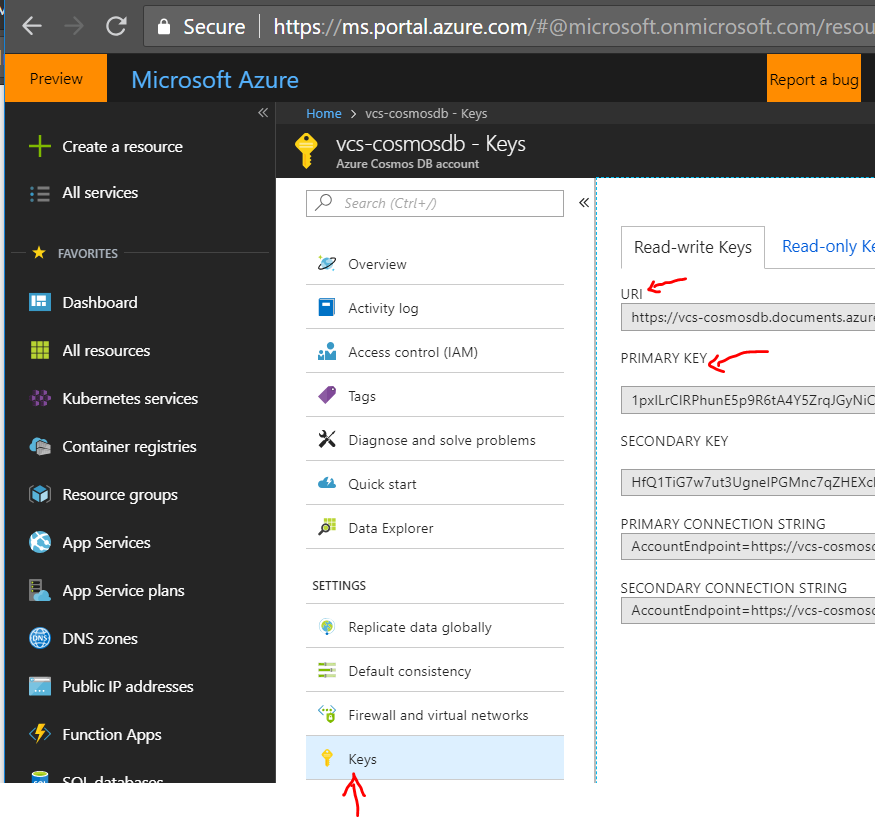
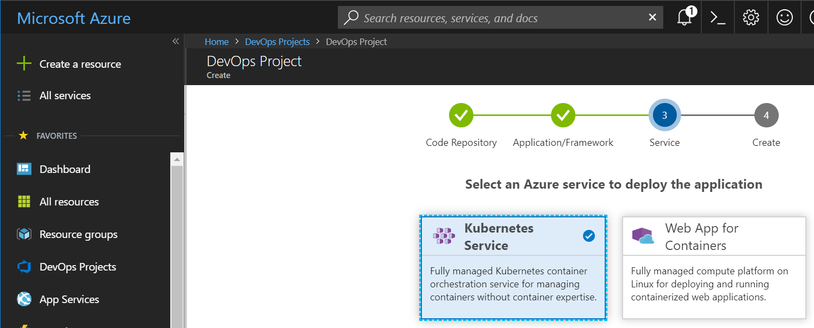
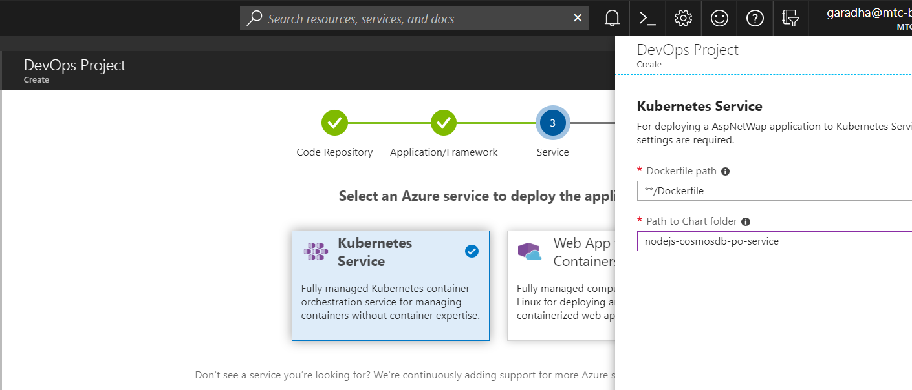
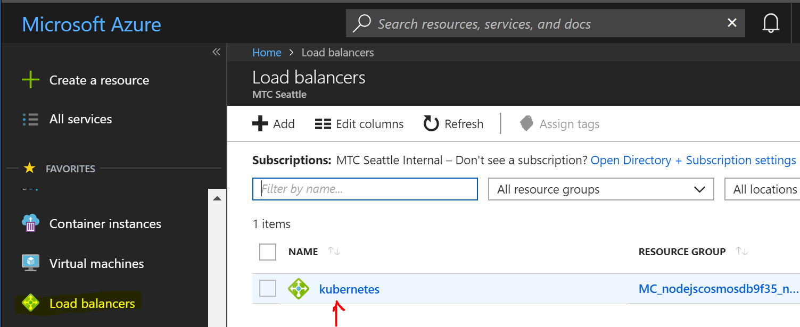
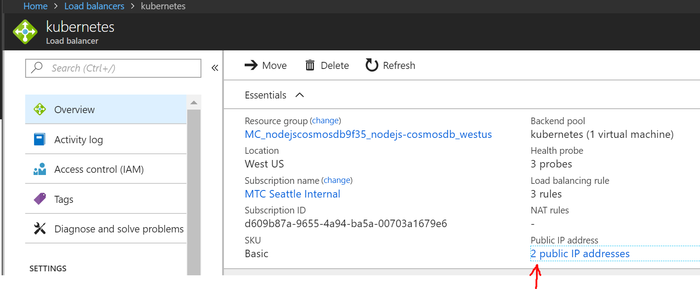

# Use *Azure DevOps Project* to build and deploy a containerized Nodejs *Microservice* 
This project details the steps for deploying a *Express.js* application using the [Azure DevOps Projects](https://azure.microsoft.com/en-us/features/devops-projects/) PaaS service.  This application exposes a simple REST API for manipulating (CRUD) *Purchase Orders* and the purchase order documents (JSON messages) are persisted in a [Azure CosmosDB](https://azure.microsoft.com/en-us/services/cosmos-db/) No-SQL database.

With Azure DevOps Projects, there are two options for building and deploying a containerized application 
1.  [Azure App Service on Linux](https://docs.microsoft.com/en-us/azure/app-service/containers/app-service-linux-intro).  Refer to **Section [A]** in order to build and deploy this application to [Web App for Containers](https://azure.microsoft.com/en-us/services/app-service/containers/) on Azure App Service.
2.  [Azure Kubernetes Service](https://azure.microsoft.com/en-us/services/kubernetes-service/).  Refer to **Section [B]** in order to build and deploy this application to AKS.

Both options use DevOps CI/CD workflows in VSTS to build and deploy the containerized application.  The CI/CD workflows are automatically created by Azure DevOps Project.  We will examine both of these options for deploying our containerized application on Azure.

**PREREQUISITES**
1. This application uses an *Azure CosmosDB* instance to persist the purchase orders.  Using the Azure Portal, create a new instance of Azure CosmosDB. Click on the 'Keys' blade and take a note (save) of the values for *URI* and *PRIMARY KEY* properties.  See screenshot below.

   

2. Fork this [GitHub repository](https://github.com/ganrad/nodejs-aks-cosmosdb-po-api) to **your** GitHub account.  After logging in to your GitHub account via a browser, click on **Fork** in the upper right hand corner to get a copy of this project added to your GitHub account.

3. In the file **config.js**, specify the correct values for *config.host* and *config.authkey* properties.  Substitute the value of **URI** in *config.host* and **PRIMARY KEY** in *config.authkey*.

### A] Deploy to Azure App Service on Linux
1. Login to your account on Azure Portal, click on *All services* and search for *DevOps Projects* service. Add this service to your navigational pane by clicking on the *star* beside the service. Next, click on *DevOps Projects* to open the blade and click on **Add** to start the DevOps Project wizard.  See screenshot below.

   

   In the next page, select *Build your own code* as shown in the screenshot below.  Then click **Next**.

   

   On the *Code Repository* page, select *GitHub* and this repository which you forked earlier.  You may be prompted to login to your GitHub account with your credentials.  See screenshot below.  Click **Next**.

   

   On the next page, click on **YES** for *Is app Dockerized* as shown below.  Click on **Next**.

   

   On the *Application/Framework* page, select *Web App for Containers* as shown below.

   

   Leave the value of *Dockerfile path* as is and specify **node app.js** as the value for *Startup Command*.  Then click **OK** and **Next**.

   

   On the *Service* page, create a new or use an existing VSTS organization.  Then give the VSTS project a meaningful name.  Also, select an *Azure Subscription*, give a name for the *Web app* and specify the *Location* where the Azure resources will be deployed. See screenshot below.  Make a note of the *Web app name*.  

   

   Click on **Done**.  The *DevOps Project* wizard shall execute the following steps
   - Provision build (Continuous Integration) and release (Continuous Deployment) pipelines for the application in VSTS and run the pipelines. The release pipeline will build an application container image and push the image to a new [Azure Container Registry](https://azure.microsoft.com/en-us/services/container-registry/) instance.
   - Provision and deploy the containerized application to a *Web App for Containers Service on Linux*.  The Web App Service will be provisioned in a App Service Plan ([Web app name]-hostingPlan). Review the *App Service* and *App Service Plan* details in the Azure Portal.

2. Examine the deployed build and release (CI/CD) pipelines in your VSTS account. Review Web App Service (Web app name) resources in Azure using the portal (or CLI).  Also, verify that the application container image got built and pushed to a new *Azure Container Registry (ACR)* instance ([Web app name]xxxx).

3. The microservice application can now be accessed via a browser at *https://[Web app name].azurewebsites.net*.

4. Use the test scripts in the *test-scripts* folder of this project to fetch, add, update & delete purchase orders.  Update the REST API URLs in the scripts to point to your App Service end-point. The test scripts invoke the REST API's exposed by this Nodejs application.  Invoke the *test-scripts/insert-orders.sh* script from a terminal window (or a browser based REST Client such as Postman or ARC) to create purchase orders in the backend Azure CosmosDB document repository.  Verify the purchase order documents got created/updated/deleted in the Azure CosmosDB database via the Azure portal.  

5. After you are done testing the application, you can delete the *App Service* via the Azure portal.  This will delete the *App Service* and the *App Service Plan* in Azure.  You will need to manually delete the *Azure Container Registry (ACR)* and *DevOps Project* instances in Azure.  Deleting the Azure *DevOps Project* will also delete corresponding resources (CI and CD pipelines, work items etc) in VSTS.

### B] Deploy to Azure Kubernetes Service
1. Login to your account on Azure Portal, click on *All services* and search for *DevOps Projects* service. Add this service to your navigational pane by clicking on the *star* beside the service. Next, click on *DevOps Projects* to open the blade and click on **Add** to start the DevOps Project wizard.  See screenshot below.

   

   In the next page, select *Build your own code* as shown in the screenshot below.  Then click **Next**.

   

   On the *Code Repository* page, select *GitHub* and this repository which you forked earlier.  You may be prompted to login to your GitHub account with your credentials.  See screenshot below.  Click **Next**.

   

   On the next page, click on **YES** for *Is app Dockerized* as shown below.  Click on **Next**.

   

   On the *Application/Framework* page, select *Kubernetes Service* as shown below.

   

   Leave the value of *Dockerfile path* as is and specify value **nodejs-cosmosdb-po-service** for *Path to Chart folder*. Then click **Ok** and **Next**.

   

   On the *Service* page, create a new or use an existing VSTS organization.  (You should already have a VSTS Account!).  Give the VSTS project a meaningful name and select an *Azure Subscription*.  Leave the *Cluster Name* field as is, it should default to the value of the project name.   Specify the *Location* where the Azure resources will be deployed.  Make a note of the *Project name*.  Then click on *Change* as shown in the screen shot below.

   

   Change the *Node count* to **1** and *Kubernetes Version* to **1.8.7**.  You can either leave the other field values as is or change the default values if needed.  Then click **OK**.  See screenshot below.

   

   **NOTE:** The DevOps Projects wizard will specify the latest release of Kubernetes (v1.11.2 at the time of this writing) by default.  You will need to change the version to **1.8.7** otherwise the execution of the CD pipeline will fail (Helm upgrade step).  If you would like to deploy this microservice to the latest Kubernetes version, you will need to update the API *version* numbers for Kubernetes resources in your forked GitHub repository.  The Kubernetes API resource definitions (manifest files) can be found in directory *nodejs-cosmosdb-po-service*.

   Click on **Done**.  The *DevOps Projects* wizard shall execute the following steps
   - Provision build (Continuous Integration) and release (Continuous Deployment) pipelines for the application in VSTS and run the pipelines. The build pipeline will build an application container image and push the image to a new *Azure Container Registry* (ACR) instance.  Upon successful execution of the build pipeline, the release pipeline will be triggered. The release pipeline will use [Helm Package Manager](https://helm.sh/) to deploy the application to AKS.  Helm charts provided in this repository will be used to provision the containerized application to AKS.
   - Provision an AKS (Azure Kubernetes Service) instance on Azure.

   It will take approximately 15-20 minutes (maybe more) to provision all the resources in VSTS and AKS.  So be patient and take a coffee break, perhaps treat yourself to a pastry!

2. Wait for the *Notification* panel in Azure portal to confirm that the deployment of all resources succeeded.  At this point, you want to take some time to examine all the resources which were provisioned in 
   - **Azure** : DevOps Project, AKS, ACR and Load Balancer
   - **VSTS** : Build and Release pipelines

3. Open the **Load Balancer** blade in Azure Portal to find the Public IP address of the application service endpoint.  See Screenshot below.

   

   In the overview pane, click on **2 public IP addresses**.  

   

   In the **Frontend IP configuration** pane, you should see two IP addresses.  Use either one of the IP addresses to access the purchase order service REST endpoint eg., http://[IP address]/orders

4. Use the test scripts in the *test-scripts* folder of this project to fetch, add, update & delete purchase orders.  Update the REST API URLs in the scripts to point to your App Service end-point. The test scripts invoke the REST API's exposed by this Nodejs application.  Invoke the *test-scripts/insert-orders.sh* script from a terminal window (or a browser based REST Client such as Postman or ARC) to create purchase orders in the backend Azure CosmosDB document repository.  Verify the purchase order documents got created/updated/deleted in the Azure CosmosDB database via the Azure portal.  

5. After you are done testing the application, you can use the Azure portal to delete the **Resource Group** in which all the resources were deployed.  This will delete all resources provisioned in Azure and VSTS (Project).

   

Congrats!!  You have successfully explored two options provided by **Azure DevOps Project** PaaS service for automating the build and deployment of a containerized Nodejs application on Azure.

To sum it up, *Azure DevOps Projects* allows application development teams to easily and quickly adopt DevOps (CI and CD) and deploy containerized applications written in a variety of programming languages on Azure.

