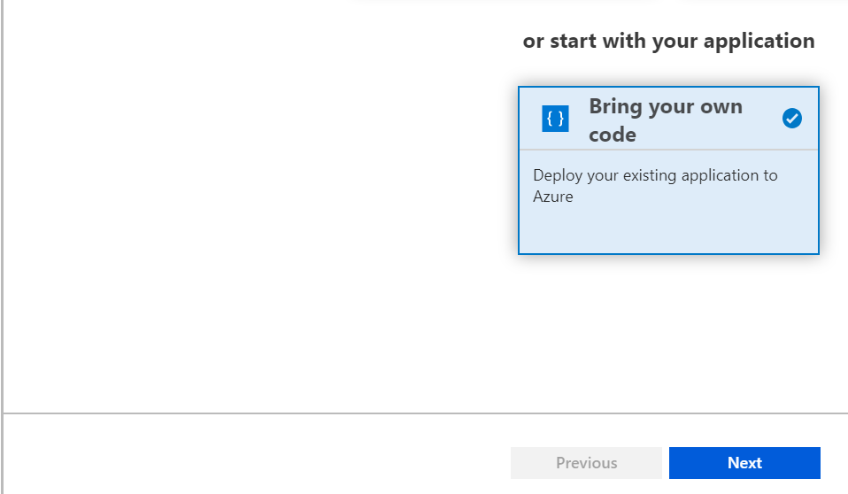
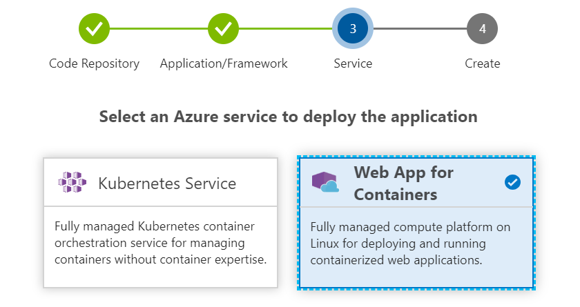
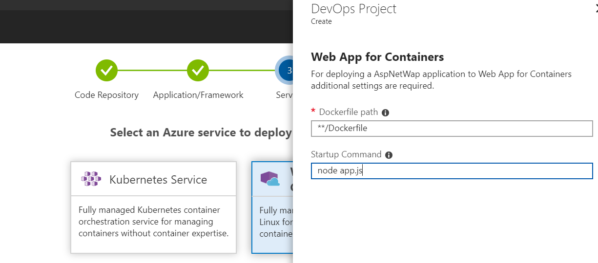
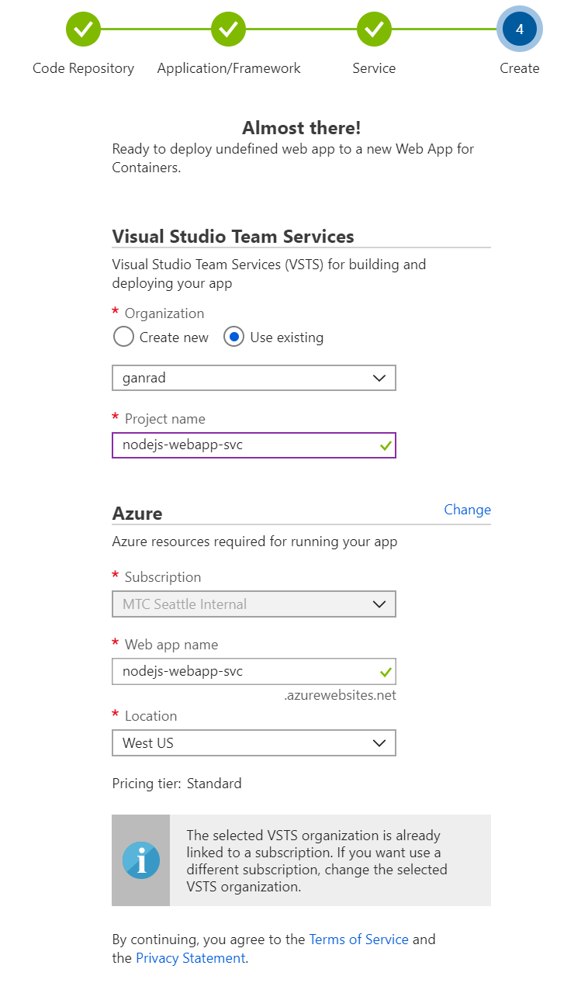

# Use *Azure DevOps Project* to build and deploy a containerized Nodejs application 
This project details the steps for deploying a *Express.js* application using the *Azure DevOps Project* feature.  This application exposes a simple REST API for manipulating (CRUD) *Purchase Orders* and the purchase order documents (JSON messages) are persisted in a *Azure CosmosDB* No-SQL database.

With Azure DevOps Project, there are two options for building and deploying a containerized application 
1.  [Azure App Service on Linux](https://docs.microsoft.com/en-us/azure/app-service/containers/app-service-linux-intro).  Refer to **Section [A]** in order to build and deploy this application to Azure App Service.
2.  [Azure Kubernetes Service](https://azure.microsoft.com/en-us/services/kubernetes-service/).  Refer to **Section [B]** in order to build and deploy this application to AKS.

Both options use DevOps CI/CD workflows in VSTS to build and deploy the containerized application.  The CI/CD workflows are automatically created by Azure DevOps Project.  We will examine both of these options for deploying our containerized application on Azure.

**PREREQUISITES**
1. Deploy an Azure CosmosDB instance
This application uses an *Azure CosmosDB* instance to persist the purchase orders.  Using the Azure Portal, create a new instance of Azure CosmosDB. Click on the 'Keys' blad and take a note (save) of the values for *URI* and *PRIMARY KEY* properties.  See screenshot below.

2. Fork this [GitHub repository](https://github.com/ganrad/nodejs-aks-cosmosdb-po-api) to **your** GitHub account.  After logging in to your GitHub account via a browser, click on **Fork** in the upper right hand corner to get a copy of this project added to your GitHub account.

3. In the file **config.js**, specify the correct values for *config.host* and *config.authkey* properties.  Substitute the value of **URI** in *config.host* and **PRIMARY KEY** in *config.authkey*.

### A] Deploy to Azure App Service on Linux
1. Login to your account on Azure Portal, click on *All services* and search for *DevOps Projects* service. Add this service to your navigational pane by clicking on the *star* beside the service. Next, click on *DevOps Projects* to open the blade and click on **Add** to start the DevOps Project wizard.  See screenshot below.

In the next page, select *Build your own code* as shown in the screenshot below.  Then click **Next**.

On the *Code Repository* page, select *GitHub* and this repository which you forked earlier.  See screenshot below.  Click **Next**.

On the next page, click on **YES** for *Is app Dockerized* as shown below.  Click on **Next**.

On the *Application/Framework* page, select *Web App for Containers* as shown below.

Leave the value of *Dockerfile path* as is and specify **node app.js** as the value for *Startup Command*.  Then click **OK** and **Next**.

On the *Service* page, create a new or use an existing VSTS organization.  Then give the VSTS project a meaningful name.  Also, select an *Azure Subscription*, give a name for the *Web app* and specify the *Location* where the Azure resources will be deployed. See screenshot below.  Make a note of the *Web app name*.  

Click on **Done**.  The *DevOps Project* wizard shall execute the following steps
- Provision build and release pipelines for the application in VSTS and run the pipelines. The release pipeline will build an application container image and push the image to a new container registry in Azure.
- Provision and deploy the containerized application to a Web App Service on Linux.  The Web App Service will be provisioned in a App Service Plan.

The application can now be accessed via a browser at *[web app name].azurewebsites.net*.

2.  Examine the deployed build and release (CI/CD) pipelines in your VSTS account. Review Web App Service resources in Azure using the portal (or CLI).  Also, verify that the application container image got built and pushed to a new Azure Container Registry (ACR) instance.

3. Use the test scripts in the *test-scripts* folder of this project to fetch, add, update & delete purchase orders.  Update the REST API URLs in the scripts to point to your App Service end-point. The test scripts invoke the REST API's exposed by this Nodejs application.  Invoke the *test-scripts/insert-orders.sh* script from a terminal window (or a browser based REST Client such as Postman or ARC) to create purchase orders in the backend Azure CosmosDB document repository.  Verify the purchase order documents got created/updated/deleted in the Azure CosmosDB database via the Azure portal.  

4. After you are done testing the application, you can delete the *Web App Service* via the Azure portal.  This will delete all resources created in VSTS and Azure.

### B] Deploy to Azure Kubernetes Service
